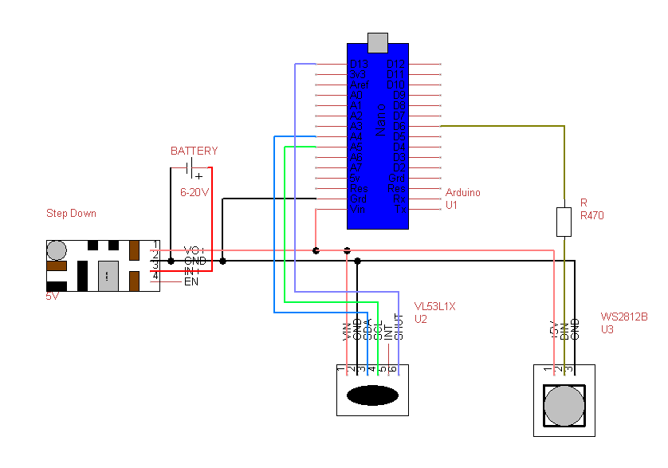
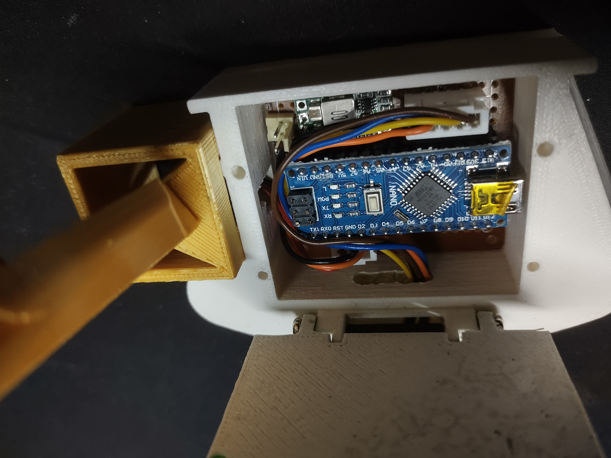

# Clipping point sensor with vl53l1x sensor

In the world of RC drift competitions it is good to know how close is the car to the wall.
Here comes the proximiti meter witch shows this on LED display.

This project is based on Arduino nano board that gets distance from laser sensor vl53l1x an displays it on ws2812b RGB LED dtripe.
Similar sensors were used in RC drift competitions in poland D10 Battle of poland and germany Clash of Titans.

A lot of people asked me how to get such clpping point. Questions from RC drift community that supported me in my projects. 
So I've started new project that comes with guidelines as follows:
* Simple code,
* Use common modules of electronic components,
* Three elements board that is easy to assemble,
* Complete 3D project.

And it's done. 


# Things to buy:
* Step-down converter 12-24V input, 5V 3A output

* Arduino Nano
* Laser sensor VL53L1X (ToF)

* DC5V WS2812B Led Strip 60leds/m 
* Resistor 470 Ohm
* JST 2Pin connector
* JST 3Pin connector
* JST 5Pin connector
* BLS 6Pin connector
* Universal board
* Wires
* Screws

# Circuit diagram

Simple circuit diagram.


Universal small PCB board is enough to assemble.


# The code
After assembling all together using Arduino IDE code can be uploaded to device.

Full code you can find in arduino folder.

You need to install addition library Adafruit_NeoPixel for manaing LEDs, and VL53L1X from Pololu to operate laser sensor.

## How it works

At first range when program will operate is set.
```
int min_range=90;
int max_range=260;
int mid_range=(max_range-min_range)/4;
```
LED's are in four groups so mid_range is needed for flash next group.

When sensor detects object in max_range it sets colors of pixels in distance groups 1 to 4.

If object is out of range program is counting to value set in count variable end then clear LEDs.

It is possible to see the output of sensor in Arduino IDE monitor when debug flag is set.

For some disturbence in sensor there is check for not getting siglal from it and reset if it's still.

# The body
Full 3D body project is available in 3d_prints folder


For LED cover you can use 12mm cover from led profile for now


# The End
I must thank Marcin Wojcik ( https://fckit.pl ) and Rock Stopar for pushing me to finish this project.

If you find this project usefull, you can support me in continuing my work here https://www.paypal.com/donate/?business=YUMQAZ7P7YHWA&no_recurring=1&currency_code=EUR
